# Atelier AI — Claude Architect Enterprise Learning & Assessment Operating System

<div align="center">

[-10b981?style=for-the-badge&logo=anthropic)](https://github.com/FrankAsanteVanLaarhoven/ATELIER-AI)
[](https://github.com/FrankAsanteVanLaarhoven/ATELIER-AI)
[](https://github.com/FrankAsanteVanLaarhoven/ATELIER-AI)
[](https://github.com/FrankAsanteVanLaarhoven/ATELIER-AI)
[](LICENSE)

<br/>


### *Specify the model. Defend the invariant.*

**Atelier AI** is a state-of-the-art, enterprise-grade learning and assessment operating system aligned with the public **Claude Certified Architect — Foundations (CCAR-F)** blueprint. Built with a high-performance **Linear-inspired dark obsidian palette** and **Keyline editorial studio typography**, Atelier provides technical leaders, solutions architects, and AI engineers with a hands-on simulator to master multi-agent orchestration, Model Context Protocol (MCP) integrations, Claude Code harnesses, and governed executive deliverables.

</div>

---

## 📖 About Atelier OS

Modern enterprise AI deployments fail not because foundational models lack reasoning capability, but because systems lack **deterministic boundaries, least-privilege scoping, and robust failure recovery**. 

Atelier was architected to solve this exact capability gap. Unlike static video courses or trivia quizzes, Atelier operates on an unwavering systems engineering principle:

> **The Invariant Rule**: *Use deterministic software for invariants and probabilistic agents for judgment. Never ask the model to enforce what code can enforce reliably.*

### Target Roles
- **Enterprise Solutions Architects**: Designing multi-agent topologies, security trust boundaries, and MCP connector perimeters.
- **AI & Software Engineers**: Building with Claude Code, writing deterministic Agent SDK hooks, and integrating headless CI/CD evaluation gates.
- **Technical Leaders & Executives**: Defending business case ROI, governance policies, and translating AI synthesis into on-brand board presentations.

---

## ⚡ Core Platform Capabilities

### 1. Cinematic Veo 3 Pro / Nano Banana Video Masterclasses
- **Photorealistic Keyframe Production**: 8K architectural visualizers generated for every syllabus domain.
- **Dynamic Neural Canvas Stream**: Real-time particle and wave visualizer rendered in canvas sync with playback state.
- **Interactive Code Checkpoints**: The masterclass automatically pauses at critical architectural junctures (e.g. 07:40 in Domain 1), requiring the learner to resolve hands-on coding challenges before playback continues.
- **Source-Grounded Transcripts**: Complete timestamped scripts with click-to-jump timeline navigation.

### 2. Interactive Step-by-Step Tool Sandboxes
- **Claude Code CLI Simulator**: Realistic terminal emulator teaching `CLAUDE.md` hierarchy, modular `.claude/rules/`, progressive disclosure skills, and deterministic hook interception.
- **Model Context Protocol (MCP) Lab**: Visual JSON-RPC schema builder and structured error taxonomy simulator (`is_retryable`, `suggested_action`).
- **Multi-Agent Topology Graph & Context Bloat Meter**: Interactive SVG visualization showing coordinator-to-subagent context scoping, demonstrating **79.6% token savings** and eliminating attention degradation.
- **Executive Slide & Design Studio**: Split-pane markdown storyboard editor with live on-brand presentation rendering and mandatory claim-to-source footnote verification.

### 3. CCAR-F Blueprint-Weighted 60-Question Mock Exam
- **90 Original Scenario Questions**: Original psychometric items authored strictly to public blueprint task statements (zero proprietary or leaked items).
- **Exact Blueprint Quotas**:
  - **Domain 1**: Agentic Architecture & Orchestration (27% — 16 items)
  - **Domain 2**: Tool Design & MCP Integration (18% — 11 items)
  - **Domain 3**: Claude Code Configuration & Workflows (20% — 12 items)
  - **Domain 4**: Prompt Engineering & Structured Output (20% — 12 items)
  - **Domain 5**: Context Management & Reliability (15% — 9 items)
- **120-Minute Persistent Timer**: Full test-taking experience with question flagging, review grid, keyboard shortcuts (`1-4`, `J/K`, `F`, `⌘K`), and instant post-submission diagnostic heatmaps.

### 4. Controlled Failure-Injection Labs
Real-world enterprise case studies with interactive fault injection:
- **Case 1 (Regulated Support Refund Agent)**: Inject gateway timeouts after payment authorization to test idempotent compensation logic.
- **Case 2 (Enterprise Code Delivery Harness)**: Inject monorepo context blowouts to test path-exclusion rules and subagent context bounds.
- **Case 3 (Executive Cowork & Slides)**: Inject conflicting revenue values between CRM and accounting to verify date cutoff disagreement surfacing.

### 5. Harness Engineering Studio (5 Parts • 5 Checks)
Grounding AI agent architecture in mission-critical physical harness engineering standards (**USCAR-2, USCAR-21, AS50881, IPC/WHMA-A-620**):
- **Core Principle**: *"Mechanical first. Electrical second. Test third."* $\leftrightarrow$ In AI: *"Harness first. Model second. Eval third."*
- **The Machine Around the Model (5 Parts)**: Central `Model (core)` surrounded by `Tools`, `State`, `Perms`, `Sandbox`, and `Obs`.
- **Five Jobs, One Harness**:
  1. `TOOLS`: `prompt -> api -> result` (Strict MCP schema contracts)
  2. `STATE`: `write -> store -> recall` (Scratchpad memory & entity compaction)
  3. `PERMS`: `request -> ? -> allow` (Deterministic PreToolUse code hooks)
  4. `SANDBOX`: `limits: network • files` (Jailed container execution)
  5. `OBS`: `step -> trace -> metric` (OpenTelemetry millisecond telemetry)
- **Raw vs. Ready Matrix**: Side-by-side comparison of bare naked LLMs vs production-harnessed agents (*"bare model: zero state, zero tools, zero retries"*).
- **Forensic Trace Debugger**: Interactive replay proving *"When it fails: blame the layer, not the model"* (isolating a 504 tool timeout at `t=1.9s` where the model was never invoked, resolved via loop-layer retry rule).
- **Interactive 5-Point Routing Checks**:
  1. **Splice Distance**: $\ge 150\text{ mm}$ from any bend or clip (solving the startup 40mm splice catastrophe that caused a 12-day rework and batch recall).
  2. **Bend Radius**: $\ge 6\times$ static bundle diameter ($10\times$ in dynamic flex zones).
  3. **Thermal & Edge Clearance**: $\ge 50\text{ mm}$ from exhaust manifolds, $\ge 20\text{ mm}$ from sharp sheet metal.
  4. **Sealed Cavities**: All empty connector cavities plugged with dummy silicon seals to prevent capillary siphon.
  5. **Clip Spacing**: $\le 150\text{ mm}$ in high-vibration zones, $\le 300\text{ mm}$ in interior cabin.
- **Claude Code Plugin Skill**: Packaged as [`skills/harness-engineering/SKILL.md`](skills/harness-engineering/SKILL.md) with executable Python calculators [`skills/harness-engineering/scripts/harness_calculators.py`](skills/harness-engineering/scripts/harness_calculators.py).

### 6. 100-Point Capstone Studio & Direct Claude Code MCP Connector
- **4 Real Enterprise Case Study Tracks**:
  - **Case 01 (Regulated Support Refund Agent)**: Claude Agent SDK with `PreToolUse` refund ceiling hooks and idempotent compensation.
  - **Case 02 (Enterprise Monorepo Code Delivery)**: Claude Code `CLAUDE.md`, `.claude/rules/` path boundaries, subagent context scoping, and non-interactive CI schema review.
  - **Case 03 (Executive Strategy & Financial Slides)**: Claude Cowork workspace, CRM vs. ERP discrepancy detection, and mandatory claim-to-source footnote citations.
  - **Case 04 (Industrial Cyber-Physical & Agentic Harness Engineering)**: USCAR-2 & AS50881 compliant cyber-physical harness with 5-point routing code hooks, MCP CAD tools, and layer-level retry rules.
- **Custom Capstone Proposal Studio**: Allows technical leaders to describe and submit their organization's custom Claude architecture (Problem Brief, Invariant Specification, Tool Schemas, and Eval Suite) and run auto-grading against the 100-point rubric.
- **Direct Claude & Claude Code MCP Connector (`claude-code-mcp-connector`)**:
  - Live JSON-RPC bridge recording every Claude command, keystroke stroke, and tool call into an immutable provenance ledger.
  - Real-time architectural validator catching security antipatterns (e.g. `--dangerously-skip-permissions` or prompt-only monetary ceilings).
- **100-Point Multi-Dimension Rubric**: 10 comprehensive assessment dimensions with strict pass bands (Band 1: Production Ready $\ge 85$).
- **Separate Verified Capstone Credential**: Distinct from the diagnostic exam certificate, issues the **Claude Certified Architect — Capstone & Enterprise Tooling Credential (`CCAR-CAPSTONE-2026`)** with verified keystrokes, tool calls, and on-chain audit hash.

### 7. CCAR-SEC-1 Anti-Cheat Proctor & Exam Integrity Studio
- **Focus-Lock & Tab-Switch Sensor**: Real-time listeners on `window.blur` and `document.visibilitychange` catch and warn candidates when switching browser windows or clicking outside the evaluation surface.
- **Full Clipboard Quarantine**: Prohibits copy, cut, and paste interactions (`copy`, `cut`, `paste` events intercepted with `preventDefault()`), preventing external LLM prompting or question exfiltration.
- **Developer Tools & Shortcut Trap**: Hard blocks `F12`, `Cmd+Opt+I`, `Cmd+Shift+I`, and right-click context inspection.
- **Dynamic Forensic Screen Watermarking**: Injects rotating, semi-transparent candidate identity and timestamp tokens across exam stems.
- **Screen & Webcam Surveillance Feed**: Live biometric radar HUD overlay with real-time hardware capture options via `getDisplayMedia` / `getUserMedia` and persistent incident audit trails.

### 7. Direct Official Anthropic Certification Clearance
- **Readiness Verification Threshold**: Candidates completing the 60-item diagnostic mock with a score **>= 72%** and zero disqualifying proctor infractions are deemed officially ready.
- **Clearance Voucher Authorization**: Issues a cryptographically unique token (e.g. `ATH-CCARF-EYM01-2026`).
- **Direct Portal Launch**: Prominent direct links dispatch candidates directly to:
  - **Anthropic Skilljar Certification Portal**: [`https://anthropic.skilljar.com`](https://anthropic.skilljar.com)
  - **Anthropic Academy**: [`https://academy.anthropic.com`](https://academy.anthropic.com)
  - **Pearson VUE Exam Center**: [`https://home.pearsonvue.com`](https://home.pearsonvue.com)
- **Remediation Lock**: Scores under 72% lock official clearance and recommend targeted blueprint drills across weak domains.

---

## 🏛️ System Architecture

```mermaid
graph TD
    A["Atelier OS Client UI (Linear / Keyline Aesthetics)"] --> B["Command Palette (Cmd+K) & Navigation"]
    A --> C["Cinematic Video Player (Veo 3 Pro / Nano Banana)"]
    A --> D["Interactive Sandboxes (CLI, MCP, Agent Graph, Slides)"]
    A --> E["Assessment Engine (60-Item Timed Mock & Drills)"]
    A --> F["Case Study Failure Injection Labs"]
    A --> G["100-Point Capstone Defense Studio"]

    C --> C1["Live Synchronized Code Checkpoints"]
    C --> C2["Audio-Reactive Canvas Streams"]
    
    D --> D1["Claude Code Terminal Emulator"]
    D --> D2["MCP JSON-RPC Validator & Error Taxonomy"]
    D --> D3["Multi-Agent Graph & Context Bloat Meter"]
    D --> D4["Slide Studio with Provenance Citations"]
    
    E --> E1["CCAR-F Domain-Weighted Quotas (60 Items / 120m)"]
    E --> E2["Post-Exam Diagnostic Radar & Heatmaps"]
    
    F --> F1["01 Support Refund Agent (Timeout & Idempotency)"]
    F --> F2["02 Monorepo Code Delivery (Context Compaction)"]
    F --> F3["03 Executive Operations (Conflict Resolution)"]
    
    G --> G1["10-Deliverable Validation Checklist"]
    G --> G2["100-Point Rubric & Faculty Defense"]
    G --> G3["Digital Credential & SVG Certificate"]
```



---

## 📂 Repository Layout

```bash
.
├── README.md                           # Enterprise documentation and architecture overview
├── agents/
│   └── agent_catalog.yaml              # 8 role-separated enterprise agent definitions
├── capstone/
│   └── capstone.md                     # 100-point capstone brief, rubric, and defense guide
├── case_studies/
│   ├── 01_support_refund_agent.md      # Regulated refund agent & idempotency
│   ├── 02_enterprise_code_delivery.md  # Monorepo Claude Code harness & CI gating
│   └── 03_executive_cowork_slides.md   # Executive operations memo & 8-slide deck
├── content/
│   ├── curriculum_map.md               # 5 core domains + 5 applied tracks
│   └── source_register.md              # Fact verification & official evidence lineage
├── demo/                               # Full production web application
│   ├── index.html                      # Single-page application shell
│   ├── style.css                       # Linear obsidian & Keyline stone dual theme
│   ├── app.js                          # Client-side router, video player & exam engine
│   ├── data.js                         # Compiled 90-question bank, case studies & tracks
│   └── assets/                         # Generated 8K cinematic posters & title cards
├── exam_engine/
│   ├── build_bank.py                   # Psychometric question bank generator
│   ├── exam_blueprint.md               # CCAR-F domain weights & assessment design
│   ├── generate_exam.py                # 60-item mock exam synthesizer
│   ├── mock_form.json                  # Sample compiled mock exam form
│   └── question_bank.json              # 90 original scenario-based evaluation questions
├── governance/
│   └── quality_security.md             # Content provenance, security, and leak prevention
├── harness/
│   └── harness_spec.md                 # Deterministic/agentic orchestration specification
├── product/
│   ├── kpis_and_smart.md               # Learning efficacy metrics & cohort analytics
│   └── service_blueprint.md            # Enterprise SaaS architecture, RBAC & API surface
└── skills/                             # 5 reusable enterprise skills
    ├── cowork-workflow/SKILL.md        # Repeatable Cowork delegation processes
    ├── exam-item-author/SKILL.md       # Psychometric scenario question authoring
    ├── harness-builder/SKILL.md        # Agent SDK, hooks, and validator design
    ├── slide-deck-builder/SKILL.md     # Evidence-linked executive presentation builder
    └── source-verifier/SKILL.md        # Real-time docs verification against official sources
```

---

## 🚀 Quickstart & Local Deployment

Atelier OS is designed with zero external build-step friction. All styling, modules, and engines run natively in modern web browsers.

### Running Locally
```bash
# Clone the repository
git clone https://github.com/FrankAsanteVanLaarhoven/ATELIER-AI.git
cd ATELIER-AI

# Serve the demo application
python3 -m http.server 8000 --directory demo
```
Navigate to **`http://localhost:8000`** in your browser.

### Keyboard Shortcuts
| Shortcut | Action | Scope |
| :--- | :--- | :--- |
| `⌘K` / `Ctrl+K` | Open Global Command Palette | Global |
| `1`, `2`, `3`, `4` | Select Choice A, B, C, or D | Exam Engine |
| `J` | Previous Question | Exam Engine |
| `K` | Next Question | Exam Engine |
| `F` | Flag / Unflag Question | Exam Engine |
| `Space` | Play / Pause Masterclass | Video Player |

---

## 🔒 Governance, Quality & Exam Integrity

1. **Original Intellectual Property**: All 90 questions in `question_bank.json` are original scenario assessments authored to test applied judgment against the public blueprint. No questions are copied or reconstructed from live certification exams.
2. **Tiered Evidence Policy**:
   - **Tier A**: Official Anthropic certification guides and core documentation.
   - **Tier B**: Official Claude Academy coursework.
   - **Tier C**: Official developer documentation, SDK releases, and API specs.
   - **Tier D**: Reputable independent architecture references.
3. **Deterministic Security Controls**: Built-in PreToolUse hooks enforce least-privilege scoping, preventing unauthorized file writes, credential exfiltration, or unbounded directory traversal.

---

## ⚖️ Commercialization & Disclaimer

This project is an independent exam-preparation platform, laboratory simulator, and applied architecture curriculum aligned to the public Claude Certified Architect — Foundations (CCAR-F) blueprint. It is not officially endorsed, sponsored, or certified by Anthropic PBC unless separately authorized.

---

<div align="center">
  <sub>Engineered by <strong>Frank Asante Van Laarhoven</strong> • Atelier Operating System v2.6</sub>
</div>
