# Atelier AI — Applied Claude Architecture & Competency Platform

<div align="center">

[](https://github.com/FrankAsanteVanLaarhoven/ATELIER-AI)
[](https://github.com/FrankAsanteVanLaarhoven/ATELIER-AI)
[](product/production_hardening_roadmap.md)
[](governance/claims_evidence_policy.md)
[](LICENSE)

<br/>


### *Specify the model. Defend the invariant.*

**Atelier AI** is an independent learning, diagnostic, and applied laboratory platform aligned with the public **Claude Certified Architect — Foundations (CCAR-F)** blueprint. Built with a high-performance **Linear-inspired dark obsidian palette** and **Keyline editorial studio typography**, Atelier provides technical leaders, solutions architects, and AI engineers with a hands-on environment to master multi-agent orchestration, Model Context Protocol (MCP) integrations, Claude Code harnesses, and governed executive deliverables.

> **Mandatory Disclaimer:** *ATELIER-AI is an independent competency platform and is not affiliated with, sponsored by, or endorsed by Anthropic, PBC or Pearson VUE. All diagnostics, mock exams, and badges represent Atelier-issued competency evaluations and do not confer official vendor certification or licensing.*

</div>

---

## 📖 About Atelier OS

Modern enterprise AI deployments fail not because foundational models lack reasoning capability, but because systems lack **deterministic boundaries, least-privilege scoping, and robust failure recovery**. 

Atelier was architected to solve this exact capability gap across three commercial offerings:
1. **Atelier Learn**: Source-grounded modules, Claude Code repository patterns, MCP design, and structured output.
2. **Atelier Assess**: Driving-theory-style diagnostics, timed 60-item practice mocks, and psychometric cohort weakness maps.
3. **Atelier Labs**: Applied execution environments for failure injection, cyber-physical harness DRC simulation, and capstone defense.

Unlike static video courses or trivia quizzes, Atelier operates on an unwavering systems engineering principle:

> **The Invariant Rule**: *Use deterministic software for invariants and probabilistic agents for judgment. Never ask the model to enforce what code can enforce reliably.*

### Target Roles
- **Enterprise Solutions Architects**: Designing multi-agent topologies, security trust boundaries, and MCP connector perimeters.
- **AI & Software Engineers**: Building with Claude Code, writing deterministic Agent SDK hooks, and integrating headless CI/CD evaluation gates.
- **Technical Leaders & Executives**: Defending business case ROI, governance policies, and translating AI synthesis into on-brand board presentations.

---

## ⚡ Core Platform Capabilities

### 1. Cinematic Video Masterclasses
- **Photorealistic Keyframe Production**: High-fidelity architectural visualizers generated for every syllabus domain.
- **Dynamic Neural Canvas Stream**: Real-time particle and wave visualizer rendered in canvas sync with playback state.
- **Interactive Code Checkpoints**: Pauses at critical architectural junctures, requiring the learner to resolve hands-on coding challenges before playback continues.
- **Source-Grounded Transcripts**: Complete timestamped scripts with click-to-jump timeline navigation.

### 2. Interactive Step-by-Step Tool Sandboxes
- **Claude Code CLI Simulator**: Realistic terminal emulator teaching `CLAUDE.md` hierarchy, modular `.claude/rules/`, progressive disclosure skills, and deterministic hook interception.
- **Model Context Protocol (MCP) Lab**: Visual JSON-RPC schema builder and structured error taxonomy simulator (`is_retryable`, `suggested_action`).
- **Multi-Agent Topology Graph & Context Bloat Meter**: Interactive SVG visualization showing coordinator-to-subagent context scoping, demonstrating token conservation and eliminating attention degradation.
- **Executive Slide & Design Studio**: Split-pane markdown storyboard editor with live on-brand presentation rendering and mandatory claim-to-source footnote verification.

### 3. CCAR-F Blueprint-Weighted 60-Question Mock Exam
- **90 Original Scenario Questions**: Original psychometric items authored strictly to public blueprint task statements (zero proprietary or leaked items).
- **Exact Blueprint Quotas**:
  - **Domain 1**: Agentic Architecture & Orchestration (27% — 16 items)
  - **Domain 2**: Tool Design & MCP Integration (18% — 11 items)
  - **Domain 3**: Claude Code Configuration & Workflows (20% — 12 items)
  - **Domain 4**: Prompt Engineering & Structured Output (20% — 12 items)
  - **Domain 5**: Context Management & Reliability (15% — 9 items)
- **120-Minute Persistent Timer**: Driving-theory style exam experience with question flagging, review grid, keyboard shortcuts (`1-4`, `J/K`, `F`, `⌘K`), and post-submission diagnostic radar heatmaps.

### 4. Controlled Failure-Injection Labs
Real-world enterprise case studies with interactive fault injection:
- **Case 1 (Regulated Support Refund Agent)**: Inject gateway timeouts after payment authorization to test idempotent compensation logic.
- **Case 2 (Enterprise Code Delivery Harness)**: Inject monorepo context blowouts to test path-exclusion rules and subagent context bounds.
- **Case 3 (Executive Cowork & Slides)**: Inject conflicting revenue values between CRM and accounting to verify date cutoff disagreement surfacing.

### 5. Industrial CAD Formboard & Side-by-Side Claude Code CLI (Simulated Labs)
Grounding AI agent architecture in mission-critical physical harness engineering concepts (**USCAR-21 Rev 4, AS50881 Rev G, IPC/WHMA-A-620D, ISO 10218-1**):
- **Core Principle**: *"Mechanical first. Electrical second. Test third."* $\leftrightarrow$ In AI: *"Harness first. Model second. Eval third."*
- **Safety Boundary Notice**: *All CAD formboard checks, electrical calculations, and DRC rules are educational simulations. LLMs and client scripts must never be used as primary safety functions, safety interlocks, or emergency stops for physical robotics or high-voltage hardware.*
- **Interactive Drag-and-Drop Formboard & CAD Foundry (Illustrative DRC)**:
  - Drag-and-drop component palette with Connectors (TE Deutsch DT06-4S, MIL-DTL-38999, Amphenol Radsok 400A), Splices, Thermal Conduit Sleeves, Vibration Clips, and Telemetry Taps.
  - Interactive SVG bus wiring with dynamic pulsing signal flow lines.
  - Simulated Design Rule Check (DRC) illustrating USCAR-21 §4.2 ($150\text{mm}$ splice-to-bend clearance), AS50881 ($10\times$ bend radius), and IP68 sealed cavity plugs.
  - 1-Click **"Auto-Remediate Invariants"**: Relocates simulated splices along routing vectors and injects dummy cavity seals.
- **Side-by-Side Dual-Pane Claude Code CLI**:
  - Global topbar button **`[● CLAUDE CLI SIDE-BY-SIDE ⌥C]`** accessible across the application.
  - Real-time bidirectional telemetry synchronization between the formboard CAD board and the Claude Code CLI pane.
  - **`↗ Open in macOS Terminal`**: Launches the native macOS Terminal side-by-side with Claude Code running directly in the workspace directory via AppleScript IPC.
  - **`⚡ MCP Tools Inspector`**: Interactive schema modal inspecting the registered `atelier-harness` tools (`verify_harness_drc`, `calculate_derating`, `remediate_harness`, `grade_capstone`).
  - Quick action chips for instant command dispatch (`DRC Verify`, `Auto-Remediate`, `Derating Calc`, `MCP List`, `macOS Terminal ↗`).
- **Simulated Mission Presets (Educational Models)**:
  - **EV 800V Powertrain Simulation**: Dual SiC Inverter (USCAR-21 splice invariants, high-voltage interlock loop simulation).
  - **Aerospace Fly-By-Wire Model**: AS50881 Triple-Redundant Avionics EWIS educational routing.
  - **6-Axis Robotic Cell**: Articulated Continuous-Flex Torsion Harness (illustrating ISO 10218-1 boundaries).
  - **Autonomous Financial Orchestrator**: Invariant Bus with $500 threshold lock and dual-signature approval.
- **Signal Oscilloscope Widget**: Hardware canvas simulation illustrating nominal impedance matching vs. simulated fault / HTTP 504 packet jitter.
- **Claude Code Configuration & Skills**:
  - Canonical [`CLAUDE.md`](CLAUDE.md) project guidelines and physical invariants.
  - Pre-registered [`mcp/harness_mcp_server.py`](mcp/harness_mcp_server.py) with standard stdio JSON-RPC 2.0 in [`.mcp.json`](.mcp.json).
  - Packaged skill in [`skills/harness-engineering/SKILL.md`](skills/harness-engineering/SKILL.md) with Python mathematical calculators [`skills/harness-engineering/scripts/harness_calculators.py`](skills/harness-engineering/scripts/harness_calculators.py).

### 6. 100-Point Capstone Studio & Applied Defense
- **4 Applied Enterprise Case Study Tracks**:
  - **Case 01 (Regulated Support Refund Agent)**: Claude Agent SDK with `PreToolUse` refund ceiling hooks and idempotent compensation.
  - **Case 02 (Enterprise Monorepo Code Delivery)**: Claude Code `CLAUDE.md`, `.claude/rules/` path boundaries, subagent context scoping, and non-interactive CI schema review.
  - **Case 03 (Executive Strategy & Financial Slides)**: Claude Cowork workspace, CRM vs. ERP discrepancy detection, and mandatory claim-to-source footnote citations.
  - **Case 04 (Industrial Cyber-Physical Harness Simulator)**: USCAR-2 & AS50881 educational harness with 5-point routing hooks, MCP CAD tools, and layer-level retry rules.
- **Custom Capstone Proposal Studio**: Allows technical leaders to describe and submit their organization's custom Claude architecture (Problem Brief, Invariant Specification, Tool Schemas, and Eval Suite) and run evaluation against the 100-point rubric.
- **Claude Code MCP Connector (`claude-code-mcp-connector`)**:
  - Live JSON-RPC bridge recording tool calls into an auditable session log.
  - Real-time architectural validator checking for security antipatterns (e.g. `--dangerously-skip-permissions` or prompt-only monetary ceilings).
- **100-Point Multi-Dimension Rubric**: 10 comprehensive assessment dimensions with strict evaluation bands (Band 1: Production Ready $\ge 85$).
- **Atelier Capstone Defense Credential**: Issues the **Atelier Certified Architect — Capstone Defense Record (`ATELIER-CAPSTONE-2026`)** with verifiable tool-call logs and cryptographic SHA-256 artifact digests.

### 7. Candidate Telemetry & Exam Integrity Controls
- **Focus-Lock & Tab-Switch Telemetry**: Real-time event listeners on `window.blur` and `document.visibilitychange` record and alert candidates when switching browser windows.
- **Clipboard Interaction Interception**: Intercepts copy, cut, and paste interactions (`copy`, `cut`, `paste` events with `preventDefault()`) as a deterrence control against prompt leakage.
- **Developer Tools Navigation Guard**: Traps inspection shortcuts (`F12`, `Cmd+Opt+I`, `Cmd+Shift+I`) and context menus to deter casual answer inspection during timed attempts.
- **Dynamic Candidate Watermarking**: Injects candidate session identifiers and timestamp tokens across exam stems.
- **Optional Proctor Feed & Integrity Telemetry**: Candidate presence monitoring overlay via `getUserMedia` / `getDisplayMedia` with explicit opt-in consent, 30-day retention purge policies, and human review for flagged anomalies.

### 8. Diagnostic Readiness Reporting & Official Exam Preparation Gateway
- **Readiness Benchmark (72% Diagnostic Threshold)**: Candidates completing the 60-item diagnostic mock with a score $\ge 72\%$ receive an Atelier Diagnostic Readiness Confirmation.
- **Atelier Diagnostic Record**: Generates a unique verification token for internal cohort tracking (e.g. `ATL-CCARF-DIAG-2026`).
- **Official Registration Gateway**: Direct navigation links to register for official vendor exams through authorized channels:
  - **Anthropic Skilljar Certification Portal**: [`https://anthropic.skilljar.com`](https://anthropic.skilljar.com)
  - **Anthropic Academy**: [`https://academy.anthropic.com`](https://academy.anthropic.com)
  - **Pearson VUE Delivery Center**: [`https://home.pearsonvue.com`](https://home.pearsonvue.com)
- **Targeted Domain Remediation**: Scores under 72% highlight specific blueprint task statements for targeted study before attempting the official exam.

---

## 🏛️ System Architecture

```mermaid
graph TD
    A["Atelier OS Client UI (Linear / Keyline Aesthetics)"] --> B["Command Palette (Cmd+K) & Navigation"]
    A --> C["Cinematic Video Player (Veo 3 Pro / Nano Banana)"]
    A --> D["Interactive Sandboxes (CLI, MCP, Agent Graph, Slides)"]
    A --> E["Assessment Engine (60-Item Timed Mock & Drills)"]
    A --> F["Case Study Failure Injection Labs"]
    A --> G["100-Point Capstone Defense Studio"]

    C --> C1["Live Synchronized Code Checkpoints"]
    C --> C2["Audio-Reactive Canvas Streams"]
    
    D --> D1["Claude Code Terminal Emulator"]
    D --> D2["MCP JSON-RPC Validator & Error Taxonomy"]
    D --> D3["Multi-Agent Graph & Context Bloat Meter"]
    D --> D4["Slide Studio with Provenance Citations"]
    
    E --> E1["CCAR-F Domain-Weighted Quotas (60 Items / 120m)"]
    E --> E2["Post-Exam Diagnostic Radar & Heatmaps"]
    
    F --> F1["01 Support Refund Agent (Timeout & Idempotency)"]
    F --> F2["02 Monorepo Code Delivery (Context Compaction)"]
    F --> F3["03 Executive Operations (Conflict Resolution)"]
    
    G --> G1["10-Deliverable Validation Checklist"]
    G --> G2["100-Point Rubric & Faculty Defense"]
    G --> G3["Digital Credential & SVG Certificate"]
```



---

## 📂 Repository Layout

```bash
.
├── README.md                           # Enterprise documentation and architecture overview
├── agents/
│   └── agent_catalog.yaml              # 8 role-separated enterprise agent definitions
├── capstone/
│   └── capstone.md                     # 100-point capstone brief, rubric, and defense guide
├── case_studies/
│   ├── 01_support_refund_agent.md      # Regulated refund agent & idempotency
│   ├── 02_enterprise_code_delivery.md  # Monorepo Claude Code harness & CI gating
│   └── 03_executive_cowork_slides.md   # Executive operations memo & 8-slide deck
├── content/
│   ├── curriculum_map.md               # 5 core domains + 5 applied tracks
│   └── source_register.md              # Fact verification & official evidence lineage
├── demo/                               # Full production web application
│   ├── index.html                      # Single-page application shell
│   ├── style.css                       # Linear obsidian & Keyline stone dual theme
│   ├── app.js                          # Client-side router, video player & exam engine
│   ├── data.js                         # Compiled 90-question bank, case studies & tracks
│   └── assets/                         # Generated 8K cinematic posters & title cards
├── exam_engine/
│   ├── build_bank.py                   # Psychometric question bank generator
│   ├── exam_blueprint.md               # CCAR-F domain weights & assessment design
│   ├── generate_exam.py                # 60-item mock exam synthesizer
│   ├── mock_form.json                  # Sample compiled mock exam form
│   └── question_bank.json              # 90 original scenario-based evaluation questions
├── governance/
│   ├── claims_evidence_policy.md       # Tiered claims & evidence policy (Tier 1/2/3)
│   ├── expert_audit_2026-09-24.md      # Comprehensive architecture, psychometrics & product audit
│   └── quality_security.md             # Content provenance, security, and leak prevention
├── packages/
│   └── schemas/                        # Typed TypeScript contracts (Question, Session, Metrics, Responses)
├── services/
│   └── assessment/                     # Stateful server assessment engine (protected keys, scoring, recovery)
├── product/
│   ├── kpis_and_smart.md               # Learning efficacy metrics & cohort analytics
│   ├── production_hardening_roadmap.md # 90-day production hardening plan & KPI matrix
│   └── service_blueprint.md            # Enterprise SaaS architecture, RBAC & API surface
└── skills/                             # 5 reusable enterprise skills
    ├── cowork-workflow/SKILL.md        # Repeatable Cowork delegation processes
    ├── exam-item-author/SKILL.md       # Psychometric scenario question authoring
    ├── harness-builder/SKILL.md        # Agent SDK, hooks, and validator design
    ├── slide-deck-builder/SKILL.md     # Evidence-linked executive presentation builder
    └── source-verifier/SKILL.md        # Real-time docs verification against official sources
```

---

## 🚀 Quickstart & Local Deployment

Atelier OS provides zero external build-step friction for initial evaluation. All styling, modules, and engines run natively in modern web browsers.

### Running Locally
```bash
# Clone the repository
git clone https://github.com/FrankAsanteVanLaarhoven/ATELIER-AI.git
cd ATELIER-AI

# Serve the demo application
python3 -m http.server 8000 --directory demo
```
Navigate to **`http://localhost:8000`** in your browser.

### Keyboard Shortcuts
| Shortcut | Action | Scope |
| :--- | :--- | :--- |
| `⌘K` / `Ctrl+K` | Open Global Command Palette | Global |
| `1`, `2`, `3`, `4` | Select Choice A, B, C, or D | Exam Engine |
| `J` | Previous Question | Exam Engine |
| `K` | Next Question | Exam Engine |
| `F` | Flag / Unflag Question | Exam Engine |
| `Space` | Play / Pause Masterclass | Video Player |

---

## 🔒 Governance, Quality & Exam Integrity

1. **Original Intellectual Property**: All questions in `question_bank.json` are original scenario assessments authored to test applied judgment against the public CCAR-F blueprint. Zero items are copied or reconstructed from live certification exams.
2. **Tiered Evidence Policy ([`governance/claims_evidence_policy.md`](governance/claims_evidence_policy.md))**:
   - **Tier 1 (Verified Production Evidence)**: Code-backed, passing automated tests, server-enforced invariants, source-pinned documentation.
   - **Tier 2 (Simulated / Lab Experiment)**: Interactive sandboxes, illustrative DRC rules, synthetic failure injection.
   - **Tier 3 (Roadmap / Aspiration)**: Scheduled features and planned calibration milestones.
3. **Deterministic Security Controls**: Built-in PreToolUse hooks enforce least-privilege scoping, preventing unauthorized file writes, credential exfiltration, or unbounded directory traversal.
4. **Assessment Service Boundary**: Protected answer keys and scoring equations are maintained in `services/assessment/`, decoupling evaluation authority from client-side inspection.

---

## ⚖️ Legal Disclaimer

**ATELIER-AI** is an independent learning platform, laboratory simulator, and applied architecture curriculum aligned to the public Claude Certified Architect — Foundations (CCAR-F) blueprint. It is **not** affiliated with, authorized by, sponsored by, or endorsed by Anthropic, PBC or Pearson VUE. All diagnostics, mock exams, and badges represent Atelier-issued competency evaluations and do not confer official vendor certification or licensing.

---

<div align="center">
  <sub>Engineered by <strong>Frank Asante Van Laarhoven</strong> • Atelier Operating System v2.6</sub>
</div>
