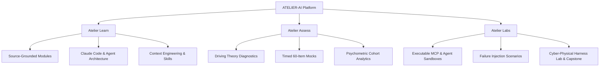

# 90-Day Production Hardening Roadmap

**Plan Inception:** 2026-09-24  
**Target Completion:** 90 Days (Q4 2026)  
**Objective:** Transition ATELIER-AI from a prototype into a modular, calibrated, enterprise-ready assessment and applied AI lab platform.

---

## 1. Architectural Target: Monorepo & Service Separation

```
atelier-ai/
├── apps/
│   ├── web/                    # Next.js / Vite client for learners (lessons, drills, mock exams, lab workbench)
│   └── admin/                  # Admin dashboard (authoring, reviewer approvals, cohort analytics, psychometrics)
├── services/
│   ├── assessment/             # Fastify / Node service: session state, timer, autosave, scoring, attempt recovery
│   ├── content/                # Versioned curriculum, item bank, source citations, question lifecycle
│   ├── evals/                  # Sandboxed runner for failure injection, invariant testing, and capstone grading
│   └── integrations/           # Claude API adapters, MCP connector registry, tool execution runtime
└── packages/
    ├── policy/                 # Deterministic authz, rate limits, tool side-effect gates, claims validation
    ├── schemas/                # Shared Zod / TypeScript contracts (items, sessions, rubrics, telemetry)
    └── design-system/          # UI tokens, components, exam navigation widgets
```

---

## 2. Product Packaging: The Triad



---

## 3. Four-Phase 90-Day Execution Schedule

### Phase 1: Governance, Claims Sanitization & Contract Schemas (Weeks 1–3)
- [ ] **Commit Governance Standards:** Merge `governance/claims_evidence_policy.md`, `governance/expert_audit_2026-09-24.md`, and this roadmap into the codebase.
- [ ] **Sanitize Public Documentation:** Audit `README.md`, demo prompts, and landing copy to remove claims of "official" readiness, vendor vouchers, or unverified safety guarantees.
- [ ] **Define Shared Schemas (`packages/schemas`):**
  - Extract and type: `Question`, `QuestionVersion`, `ExamSession`, `LearnerResponse`, `ItemMetrics`, `TelemetryEvent`, `CapstoneSubmission`.
- [ ] **Demarcate Safety & Standards:** Add explicit disclaimers and revision citations to all AS50881, USCAR, IPC, and robotics safety modules.
- **Milestone Gate 1:** 100% of documentation compliant with Tier 1/2/3 claims policy; typed schema contracts published.

### Phase 2: Assessment Core & Protected Exam State (Weeks 4–6)
- [ ] **Extract `services/assessment`:**
  - Implement server-side form generator (stratified by 5 domains and task quotas).
  - Store protected answer keys server-side; strip keys and rationales from client payloads until session completion.
  - Implement optimistic autosave heartbeat (`PATCH /sessions/:id/responses/:itemId`).
  - Build persistent session recovery logic (tolerates page reloads, tab closes, and network drops).
- [ ] **Enforce Deterministic Policy (`packages/policy`):**
  - Implement time-drift checks (server-authoritative exam countdown).
  - Rate limiting on submission endpoints.
- [ ] **Write Unit & Integration Tests:**
  - Session lifecycle tests, scoring equation tests, recovery under network disconnect tests.
- **Milestone Gate 2:** $\ge 80\%$ test coverage on assessment core; zero answer keys sent to browser; 100% session recovery verified.

### Phase 3: Content Service & Evals Lab Hardening (Weeks 7–9)
- [ ] **Develop `services/content`:**
  - Source lineage tracking: require every item to reference a validated URL and retrieval timestamp.
  - Question review lifecycle: `draft` $\to$ `in_review` $\to$ `calibrating` $\to$ `active` $\to$ `retired`.
- [ ] **Harden `services/evals` (The Applied Moat):**
  - Build automated failure-injection engine for Claude Code and Agent SDK pipelines.
  - Create invariant-checking test harnesses for tool call verification.
  - Package one complete automated capstone evaluation (e.g., Enterprise Agent Architecture Defense).
- [ ] **Refactor Telemetry Layer:**
  - Shift proctoring features to explicit consent telemetry.
  - Implement 30-day auto-purge for candidate logs.
- **Milestone Gate 3:** Capstone verification harness passes automated runs; all scored items traceable to versioned sources.

### Phase 4: Admin Console, Controlled Pilot & Calibration (Weeks 10–12)
- [ ] **Deploy `apps/admin`:**
  - Reviewer dashboard for source inspection and item approval.
  - Psychometric reporting dashboard ($p$-value, point-biserial $r_{pb}$, distractor frequency).
- [ ] **Execute Controlled Pilot (20–50 Candidates):**
  - Run structured diagnostic $\to$ mock $\to$ capstone sequence with test cohort.
  - Gather empirical telemetry on question difficulty and distractor efficiency.
  - Flag items with $r_{pb} < 0.20$ or zero-hit distractors for revision.
- [ ] **Publish Pilot Findings Report:** Document baseline psychometrics and operational uptime.
- **Milestone Gate 4:** Successful completion of 20–50 user pilot; initial psychometric item calibration completed.

---

## 4. Key Performance Indicator (KPI) Tracking Matrix

| KPI | Target (Day 90) | Current Baseline | Verification Method |
| :--- | :--- | :--- | :--- |
| **Source Provenance** | 100% of live items source-linked | ~75% (unverified links) | Automated schema check in CI |
| **Claims Evidence Compliance** | 0 Tier-violating public claims | Multiple overclaims | PR review & claims audit checklist |
| **Core Test Coverage** | $\ge 80\%$ statement / branch | Minimal | Vitest / Jest coverage report in CI |
| **Session Disconnect Recovery** | 100% active state restored | Partial / LocalStorage | Automated headless browser disconnect test |
| **Tool Authorization & Idempotency** | 100% consequential tools gated | Ad-hoc | Policy package middleware verification |
| **Pilot Psychometric Calibration** | 20–50 candidate dataset | 0 (uncalibrated) | Admin psychometrics analytics export |

---

## 5. Risk Management & Mitigations

1. **GitHub Access & Integration Permissions:**
   - *Risk:* 403 error during remote branch creation via integration.
   - *Mitigation:* Author all hardening files locally on `main` or local feature branches; push once PAT / write permissions are granted.
2. **Upstream Claude Tooling Shifts:**
   - *Risk:* Claude Code or Agent SDK CLI updates deprecate lab scripts.
   - *Mitigation:* Pin dependency versions in sandboxes and maintain automated integration smoke tests.
3. **Regulatory / Privacy Scrutiny on Proctoring:**
   - *Risk:* Learner pushback or compliance flags regarding webcam/screen capture.
   - *Mitigation:* Strict opt-in consent, transparent deterrence framing, and zero automated disciplinary decisions.
